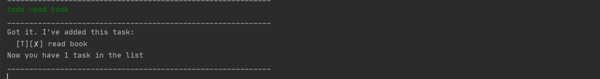
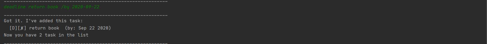
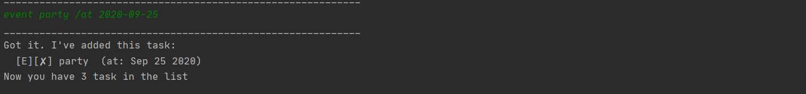
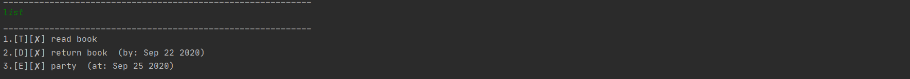
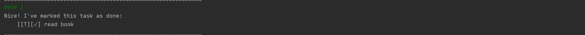
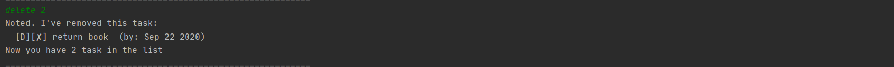
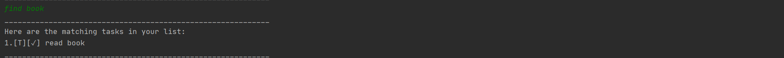
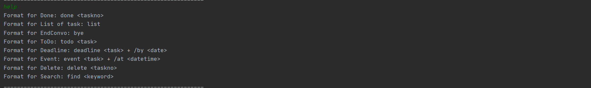
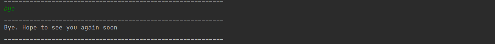

# Duke Program User Guide
* 1.[Introduction](https://github.com/dixoncwc/ip/tree/master/docs#1-introduction)
* 2.[Starting the Program](https://github.com/dixoncwc/ip/tree/master/docs#2-staring-the-program)
* 3.[Features](https://github.com/dixoncwc/ip/tree/master/docs#3-features)
    * 3.1 [Add Task](https://github.com/dixoncwc/ip/tree/master/docs#31-add-task)
    * 3.2 [Display Task](https://github.com/dixoncwc/ip/tree/master/docs#32-display-task)
    * 3.3 [Mark Task as Done](https://github.com/dixoncwc/ip/tree/master/docs#33-mark-task-as-done)
    * 3.4 [Delete Task](https://github.com/dixoncwc/ip/tree/master/docs#34-delete-task)
    * 3.5 [Search Task](https://github.com/dixoncwc/ip/tree/master/docs#35-search-task)
    * 3.6 [Show Help](https://github.com/dixoncwc/ip/tree/master/docs#36-show-help)
* 4.[Exiting the Program](https://github.com/dixoncwc/ip/tree/master/docs#4-exiting-the-program)

## 1. Introduction
Duke program is a CLi-based program that allows user to manage their task list.

## 2. Startsing the Program
Before starting the program, ensure that Java 11 is install in your computer.

1. Download the jar file from [here](https://github.com/dixoncwc/ip/releases/tag/A-Jar).
2. Extract the jar file to a root folder you prefer.
3. Open command prompt and cd to the root folder of the jar file
4. Run this command chcp 65001 to enable it 
5. Change the font type to nSimSun
6. Run this command java -Dfile.encoding=UTF-8 -jar iP.jar
7. Command prompt should display this Duke Intro Interface 

## 3. Features
### 3.1 `Add task`
Duke program allows you to do 3 different categories of task: ToDo, Deadline & Event.

##### 3.1.1 `Add a ToDo Task`
This feature will allow user to add a ToDo type of task to the list.

Format: `todo 
`

Example: `todo read book`

Output:
 

##### 3.1.2 `Add a Deadline task`
This feature will allow user to add a Deadline type of task to the list

Format: `deadline 
 /by <Date in the format of YYYY-MM-DD`

Example: `deadline return book /by 2020-09-22`

Output:

##### 3.1.3 `Add a Event task`
This feature will allow user to add a Event type of task to the list

Format: `event 
 /at <Date in the format of YYYY-MM-DD`

Example: `event party /at 2020-09-25`

Output:

### 3.2 `Display Task`
This feature will display the full list of task with the command `list`

Format: `list`

Example: `list`

Output:

### 3.3 `Mark Task as Done`
This feature will allow user to mark their task as done

Format: `done <ArrayIndex>`

Example: `done 1`

Output: 

### 3.4 `Delete Task`
This feature will allow user to delete redundant task

Format: `delete <ArrayIndex>`

Example: `delete 2`

Output: 

### 3.5 `Search Task`
This feature will allow user to search a task based on a keyword

Format: `find <keyword>`

Example: `find book`

Output:

### 3.6 `Show Help`
This feature will display a help list for user to know the usage and command

Format: `help`

Example: `help`

Output:

## 4. Exiting the Program
In order to exit the program and save the task list use command `bye`

Format: `bye`

Example: `bye`

Output:

